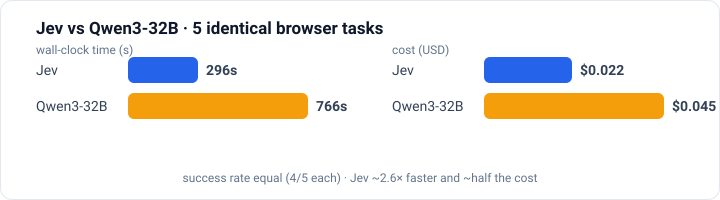

# Jev Browser Agent ⚡

**A local browser agent that reads with Browser Use, decides with Jev, and validates-and-executes with Browser Harness — ~2.6× faster and ~half the cost of a Qwen3-32B baseline at the same success rate.**

[](#) [](LICENSE)

A local browser agent using Browser Use for structured page understanding, Jev for bounded next-action selection, and Browser Harness for final validation and execution.

Jev decisions use OpenRouter's Decisions API with `~typesafe/jev-latest` and `OPENROUTER_API_KEY`. If Jev fails, returns invalid choices, or gives confidence below `0.95` for the selected operation or target, the agent asks an independent chat model to choose from the same observation. By default, fallback decisions and generated form text use OpenRouter. If `DEEPSEEK_API_KEY` is set, those chat requests go directly to DeepSeek instead; Jev remains on OpenRouter.

## Benchmarks: Jev vs Qwen3-32B

The agent's main decision comes from **Jev** (`~typesafe/jev-latest`, via OpenRouter's
Decisions API). To answer "why not just put a big general model in the loop?", the same five
browser tasks are run twice — once with Jev deciding, once with **Qwen3-32B**
(`qwen/qwen3-32b`) deciding. Success is judged independently (a required `expect` phrase on
the final page), never by the model's own `DONE`.

**Why Qwen3-32B as the comparison.** It is a strong, widely used open-weight model in the
same size class, so this is not "a specialist beating a weak model". More importantly, it is
the *fallback, text, and review* model in the Jev arm too (`FALLBACK_MODEL == QWEN_MODEL`),
so the **only** variable that changes between the two arms is the primary decision model.
That is what makes the comparison clean.

| arm | success | wall-clock | cost (USD) | decisions | fallback |
| --- | ---: | ---: | ---: | ---: | ---: |
| **Jev** | **4/5** | **296s** | **$0.022** | 21 | 14 |
| Qwen3-32B | 4/5 | 766s | $0.045 | 41 | 41 |



At the same success rate, Jev is **~2.6× faster** and **~half the cost**. The two models also
fail *differently* on the one shared failure (`wiki-site-search`): Jev stalls in "honest
hesitation" (too many similar dropdown options to lock a target at 95% confidence), while
Qwen falls behind a page that extensions rewrite ~10×/s. The full per-case table, the
root-cause attribution, and the experiment design are in
[`benchmark_results/20261005T033201Z/report.md`](benchmark_results/20261005T033201Z/report.md).

## Requirements

- Python 3.12+
- `uv`
- Chrome with Browser Harness remote debugging enabled
- Browser Use 0.13.10 (installed by `uv sync`)
- An OpenRouter API key

## Setup

```sh
uv sync
cp .env.example .env
```

Add your OpenRouter key to `OPENROUTER_API_KEY` in `.env`. The default Jev model is `~typesafe/jev-latest`; override it with `JEV_MODEL` if needed. By default, the fallback and text model is `deepseek/deepseek-chat` through OpenRouter; override `OPENROUTER_MODEL` or `TEXT_MODEL` with models available to your account. To route only Jev through OpenRouter and use your direct DeepSeek API key for fallback and text generation, set `DEEPSEEK_API_KEY` in `.env`; the direct API defaults to `deepseek-flash`, configurable through `DEEPSEEK_MODEL`. Keep `.env` private and never paste API keys into chat or commit them.

Enable Chrome remote debugging at `chrome://inspect/#remote-debugging` and keep the shown local endpoint in `BU_CDP_URL` (normally `http://127.0.0.1:9222`). This gives local clients full control of that Chrome session, including access to cookies and site data.

Check the Browser Harness connection without printing page contents:

```sh
printf 'print(type(page_info()).__name__)\n' | uv run --env-file .env browser-harness
```

The successful output is `dict`. `browser-harness --doctor` may report that no Chrome profile is running even when a direct `BU_CDP_URL` connection is healthy; the `page_info()` check exercises the configured endpoint.

## Run a task

### Local web interface

Start the local interface:

```sh
uv run --env-file .env browser-agent-ui
```

Then open <http://127.0.0.1:8766>. Enter a goal and click **开始执行**. The starting URL is optional; when omitted, the agent starts at Google. You can enter a site URL when you already know where the task should begin. **验证文本** is also optional and adds an independent check against the final page title and visible text. Leave it blank when there is no simple phrase that proves completion.

The interface connects to the configured Chrome session and shows its live page, decisions, and action history. Browser Use reads the page's structured DOM/accessibility tree; Jev chooses among the resulting candidates; Browser Harness validates and executes the selected operation. The service listens on loopback only.

The header has **重启服务** and **停止服务** controls. Restart replaces the local Python process, closes the current browser task, clears its in-memory trace, reloads code and `.env`, and refreshes the interface. Stop closes the task and server; start it again from the project directory with `uv run --env-file .env browser-agent-ui`. Sending a new instruction in the Codex conversation does not restart this separate local process.

After updating the code, restart an already-running server once from its terminal so it loads the new controls. The UI can handle later service restarts itself.

### Debugging a stopped run

Expand **查看模型收到的页面信息** and inspect `title`, `headings`, the Browser Use structured DOM representation, and `actions`. If an expected link is absent, read `candidate_diagnostics`: `not_semantic`, `no_operation`, `invisible`, `other_frame`, and `nested_duplicate` say why candidates were dropped, `dropped_labels` samples them, `title_links` counts detected result-title links, and `capped_actions` reports how many exceeded the cap. Expand **调试信息** to see the stop reason, recent model choices, and `fallback_reason`. An unhandled local error also prints a traceback in the terminal running the UI; the error panel shows an ID to match it.

Jev fallback runs when Jev errors, returns malformed choices, has confidence below `0.95`, or selects `BLOCKED` while usable actions remain. The configured direct DeepSeek call is the fallback. If DeepSeek itself errors, the run pauses and shows the error; there is no further provider configured, and no browser action is automatically retried.

### Command line

Use a plain URL (not a Markdown link):

```sh
uv run --env-file .env browser-agent \
  --url 'https://www.wikipedia.org/' \
  --goal 'Find and open the Wikipedia article about Gödel’s incompleteness theorems.' \
  --expect-text 'Gödel'
```

The command prints one JSON event per line. It stops when the model selects `DONE` or `BLOCKED`, or reaches its bounded action budget. `DONE` is a model decision; `--expect-text` independently checks for required visible text before reporting verified completion.

The agent generates text only for an observed editable field. It does not invent personal information and stops if the text helper returns no valid value.

## Boundaries

- The models return bounded operation and target choices. They never supply selectors, coordinates, JavaScript, shell commands, or executable browser code.
- Browser Use supplies the page's structured DOM/accessibility state, including supported same-page frame content. Browser Harness resolves only registered backend node IDs and rechecks visibility and hit testing before each action.
- A link whose text wraps onto two lines — a search result's url line above its title — is clicked on one of its lines, not at the centre of the box enclosing both, which falls in the gap between them and belongs to a neighbouring element. An element that is covered, or outside the viewport, is still refused.
- The models never receive executable selectors, coordinates, JavaScript, or shell commands. File uploads and custom keyboard widgets are outside the initial scope.
- A link that opens a new tab is followed: the run switches both observation and execution to it and continues there, as Browser Use does natively.
- A decision is dropped when the page changed under it. Counters and relative times inside a label (`收件箱 (3)`, `2 分钟前`) are ignored for that comparison, so ordinary label churn no longer reads as a different page. The model still sees the real label.
- If the page the run was working on is closed, the run stops with `target-lost`. It never continues on one of your other tabs, reads that tab's content, or sends it to a model.
- When the page keeps changing and the retries run out, the chat model judges the current page against the goal before the run reports a dead end. It reports met or not met with a reason; it never picks the action and never rewrites your instruction. Rescues are capped at two per run, and a configured completion text is still verified independently.
- The agent does not authenticate to sites for you, submit purchases, or claim success without independent outcome evidence.
- Generic containers, wrapper duplicates, and long row-derived accessible names are excluded from candidates; the remainder is ranked with result-title links first and capped at 60. See `ARCHITECTURE.md` for the full candidate rules.
- Page content is read from whatever page the run reaches, with no host exemptions. Mailbox and account pages included, their text and candidates go to the providers configured in `.env`. Chrome runs with your real login state, so restrict a run's goal to pages you are willing to send there.

## What this adds over `jev-ultrafast`

This repository adapts the MIT-licensed `browser-use/jev-ultrafast` loop, but its real
contribution is the **validation and execution layer** wrapped around Jev's decision.
Upstream demonstrates the loop; this project makes it hold up on real, noisy pages.

**Why three tools together.** Each has exactly one bounded job:

- **Browser Use** reads the page. It produces the structured DOM/accessibility snapshot
  (title, headings, visible controls, form state, viewport). It never acts.
- **Jev** decides. It picks one operation plus one candidate from that snapshot through
  OpenRouter's Decisions API. It never emits selectors, coordinates, or code.
- **Browser Harness** executes. It is the only component that touches the page, and it
  re-resolves the chosen node and rechecks it before every action.

The split keeps the model's output bounded to an id drawn from a candidate set, and every
action is independently re-validated by code before it runs. Browser Use understands but
does not act; Browser Harness acts but does not understand — combined, they close the
observe → decide → validate → act loop.

**Changes made to raise the success rate on real pages:**

- **Result-aware candidates.** A result title is identified by its own label, never
  borrowed from a wrapping container; results are ranked first and the set is capped at
  60, with a `candidate_diagnostics` breakdown of every dropped element.
- **Freshness that ignores ordinary churn.** Page identity covers the target, URL, title,
  headings, actions, and guard values; ambient text (ads, clocks, lazy content) is
  excluded, and self-changing label parts (`收件箱 (3)`, `2 分钟前`, clock values) are
  normalised away for comparison only.
- **A correct hit point for two-line result links.** An inline link laid out as a url line
  above a title line has per-line fragment boxes; its bounding-box centre falls in the gap
  between them and hit-tests as a neighbouring element. The executor clicks the first
  point that resolves to the element or its descendants, fixing failures that surfaced as
  `stale-page` but were really a geometry bug.
- **New-tab following.** A `target="_blank"` click moves both observation and execution to
  the tab that actually appeared, instead of re-clicking the same link forever.
- **Closed-page safety.** When the run's own page disappears it stops as `target-lost`
  rather than silently observing one of your other tabs.
- **A review pass before giving up.** When a page keeps rewriting itself, a chat model
  checks the current page against the goal before the run reports a dead end (capped at
  two rescues).
- **Form-aware candidate narrowing.** Around a partly filled form, unrelated candidates
  are dropped so the run submits instead of wandering off — unless real results are on
  screen.

See `ARCHITECTURE.md` for the full candidate, freshness, and hit-test rules.

## Project origin

This project adapts the MIT-licensed `browser-use/jev-ultrafast` browser loop and retains its license. Jev uses OpenRouter; fallback and form-text requests use OpenRouter by default or DeepSeek directly when configured.
